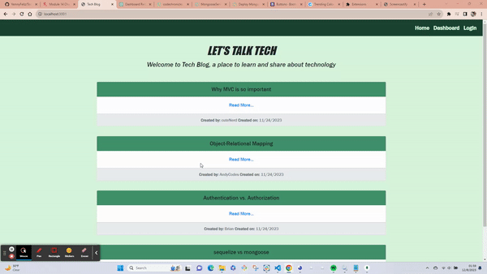

# Tech-Blog-MVC

  
   

  ## Table of Contents
  - [Description](#description)
  - [Installation](#installation)
  - [Usage](#usage)
  - [License](#license)
  - [Contributing](#contributing)
  - [Test](#tests)
  - [Questions](#questions)

  ## Description
  - Teach Blog is a website where users can create and manage their posts.
  - The homepage displays a navbar with links to home, dashboard, and login. It also shows all posts created in the site.
  - Users are able to sign-up and login to create, update, and delete posts, and keve comments.
  - Once users are signed in a logout link appears instead of the login so they can end their session if they wish.

  - [ Deployed Website ](https://techblog-yf-0ce34b9af3ec.herokuapp.com/)
 

  ## Installation
  - git clone https://github.com/YemnyFeliz/Tech-Blog-MVC.git
  - .env file:

    - DB_NAME="techblog_db
    - DB_USER="your_mysql_username"
    - DB_PASSWORD="your_mysql_password"
- cd to db folder
- mysql -u root -p (enter your mysql password)
- SOURCE schema.sql
- npm i && npm run seeds
- node server.js

  ## Usage
  

 
  ## License
  This project is licensed under [MIT](https://opensource.org/licenses/MIT) license

  ## Contributing
  Yemny Feliz

  ## Tests
  N/A

  ## Questions
  If you have any questions about this project please contact me:
  - GitHub: [@YemnyFeliz](https://github.com/YemnyFeliz)
  - Email: y.feliz1296@gmail.com